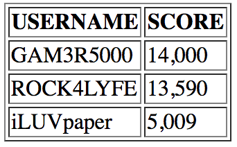

# Rock Paper Scissors!

##### You're going to create a rock paper scissors website!

### Check out these examples:
* https://www.afiniti.com/corporate/rock-paper-scissors/
* http://www.essentially.net/rsp/

## Look at what was given to you...
* You have three HTML files `home.html`, `reviews.html`, `winners.html`
* You have a `style.css` that is already linked to all of your HTML files using: `<link rel="stylesheet" type="text/css" href="style.css">` in the `<head>` tag on every HTML file
* jQuery is linked in the `<head>` of ALL of your HTML pages using: `<script src="https://ajax.googleapis.com/ajax/libs/jquery/3.2.1/jquery.min.js"></script>` in the `<head>` tags
* You have a `script.js` that is already linked in all of your HTML files using: `<script type="text/javascript" src="script.js"></script>` in the `<head>` tags

_____________________________________________________________________________ 
## LEVEL ONE

### Home Page in `home.html`
* Replace where it says "WEBSITE NAME" to something better
* Add a [heading](https://www.w3schools.com/html/html_headings.asp) to your website
* Put an `id` on the `<body>`. See below for an example
  ``` HTML
  <body id="home-body">
    ...
  </body>
  ```
* In `style.css` select the `id` to add a [background color](https://www.w3schools.com/cssref/pr_background-color.asp)
* Change the text color of this page (you can keep it black if you prefer that)
* Add at least one image to your page. It can be whatever image you would like here are some suggestions: rock paper scissors, hand games, computer games...
* Add a `<button>` to the page that says "PLAY!" put an `id` on this button tag. (you will use the `id` later)

### Contact Page in `contact.html`
* Put an `id` on the `<body>`. See below for an example
  ``` HTML
  <body id="contact-body">
    ...
  </body>
  ```
* In style.css select the `id` to add a background image on the contact page using the `background-image` CSS property. Look [here](https://css-tricks.com/perfect-full-page-background-image/) for more help. 
    * The website [stocksnap.io](https://stocksnap.io/) has some great free images. Try typing "gaming", "computer", or "office"
* Add a `<div>` that has some made up contact information. See the example below.
  ``` HTML
  <div id="contact">
    <p id="address"></p>
    <p id="phone number"></p>
  </div>
  ```
* Select the `div` by it's `id` and set the `background-color` to an [`rgba()` value](https://www.w3schools.com/cssref/tryit.asp?filename=trycss_color_rgba)
* Center the `div`

### Winners Page in `winners.html`
* Use a [`<table>` HTML](https://www.w3schools.com/html/html_tables.asp) tag to create a list of players and their scores. See the example below:
  
* Add a background color to this page
* Change the color of the font
_____________________________________________________________________________

## LEVEL TWO

### Home Page in `home.html`
* * Try changing your background color to be a [linear-gradient()](https://developer.mozilla.org/en-US/docs/Web/CSS/linear-gradient) instead of one solid color in `style.css`
* Add a [google font](https://fonts.google.com/) to your page.
  * Click on the red plus sign of the font you want to use
  * Click on the black bar at the bottom of the page that says 1 Family Selected
  * Copy the `<link>` and put it inside the `<head>` tag in your HTML file
  * Follow the font-family instructions for your CSS
* Style your "PLAY!" button to look better. Here are some CSS properties you will probably want to use:
  * `background-color`
  * `border-radius`
  * `padding`
  * `color`
  * `border`
  * `box-shadow`


### In `script.js`
* Select the "PLAY!" button using it's `id` and save it as a JavaScript variable. For example:
  * ``` var exampleVariable = $("#example-id"); ```
* Call the [click() jQuery function](https://api.jquery.com/click/) on your variable. 
  * Once the user clicks on the button we want to use prompt() to ask the user to "pick rock, paper, or scissors". See [here](https://www.w3schools.com/jsref/met_win_prompt.asp) for an example
  * Save this prompt as a variable called `userChoice`. See the example below:
    ```
      var exampleAnswer = prompt("How are you?");
    ```
  * Write an `alert()` that will say "The user choice was ___________". The "_______" should say what the user typed into the prompt. Look at the other alert in `script.js` for an example.
  * Write an `if` / `else if` / `else` statement that will determine Who won the game [example](https://www.w3schools.com/js/js_if_else.asp)
    * **If** the user chose rock and the computer chose scissors. Use `alert()` to say that the user won!
    * **Else if** the user chose paper and the computer chose scissors. User `alert()` to sat that the computer won!
    * Keep writing **else if** statements to cover all of the possibilities. 
      * Don't forget to account for ties.
      * Don't forget to account for invalid entries like "pencil"

_____________________________________________________________________________
## LEVEL THREE

### Home Page
* In `script.js` select the nav bar by it's `id` using jQuery and save it in a variable called `navBar`. It will look something like this 
  ` var exampleSelect = $("#example-id"); `
* We are going to make your navbar slowly fade in:
  * First hide your navbar. This will look something like this:
    ``` 
      exampleSelect.hide()
    ```
  * Use the [fadeIn() function](http://api.jquery.com/fadein/) to make the navbar fade in. Google it if you forget how it works.
* Get rid of the underlines on the link tags in your navigation. Google "how to remove underlines from link tags with CSS"


### In `script.js`
* Remove the `alert()`s for the `computerChoice` and `userChoice`.
* Now, we want to change the `alert()` that declares the winner to use the `append()` function
* First, let's test out the jQuery `html()` function.
  * Add a div inside your home.html with the `id` called "winner"
    ``` HTML
      <div id="winner">
        
      </div>
    ```
  * In your `script.js` select the "winner" `div` and save it in a variable called `winner`
  * Then use the `html()` function on your variable. This will add HTML inside of the winner `div`. Put the example below into your `script.js` then run your code
  ``` 
    var winner = $("#winner");
    body.html("<p>THIS IS A TEST</p>");
  ```
* Change the game winner `alert()`s to use `.html()` so that the winner is displayed on the page instead of in an pop up.

_____________________________________________________________________________
## LEVEL FOUR

## WINNERS PAGE
* Add a parallax image to your page. [See an example here](https://www.w3schools.com/howto/howto_css_parallax.asp)

## HOME PAGE
* Add another option to your rock, paper, scissors game such as dynamite!

### CREATE!
* Use your creativity to make your website even more awesome!


